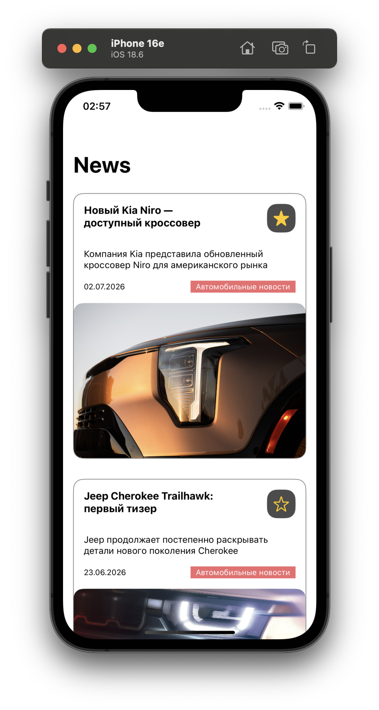
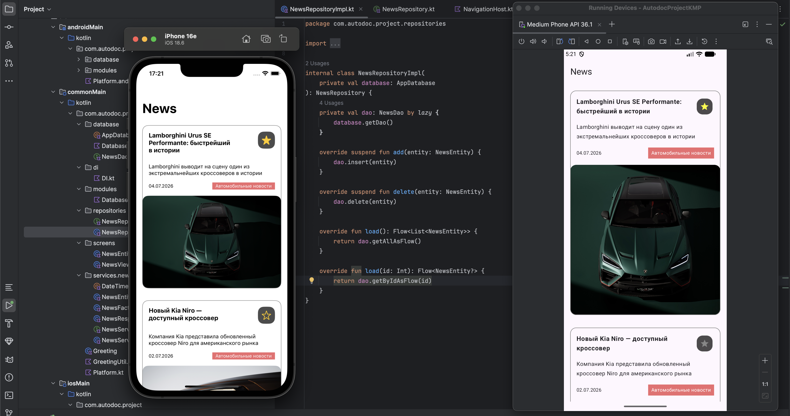

# AutodocProjectKMP - test task

Hello!

I present to you the completed test assignment for AutodocProjectKMP.
The project is designed for iOS and Android platforms.

The purpose of the project is to demonstrate the author's skills and abilities in working with mobile development technologies.

# Description

The project implements a news feed screen.

### Main

### iOS

  

### Android

  

